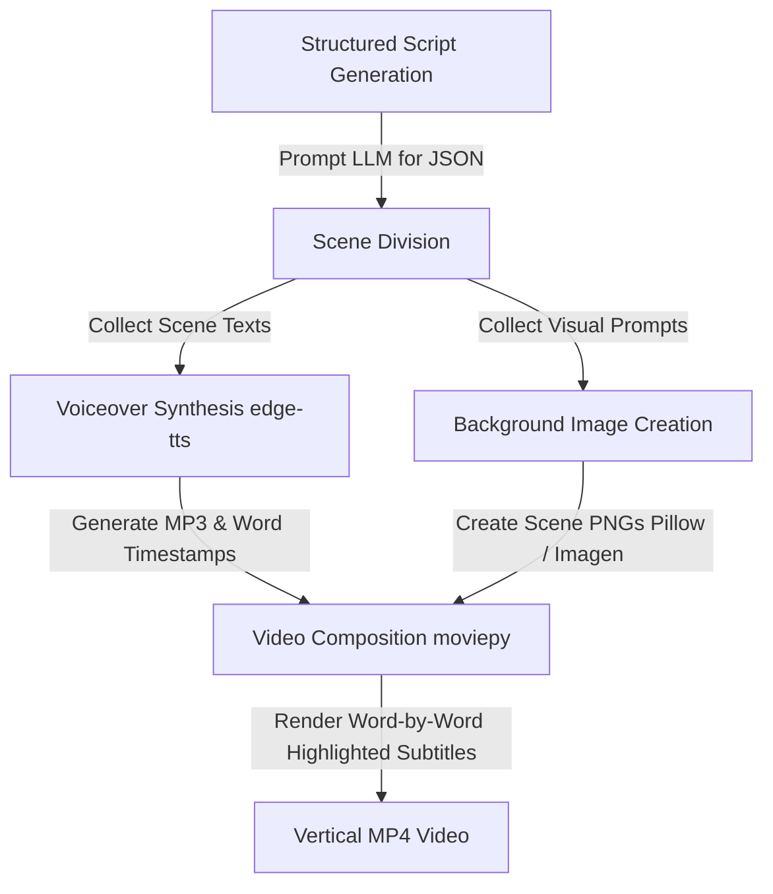

# Specialized Traffic Generation Agents

This document covers the technical details, prompt structures, libraries, and capabilities of the agents in the campaign suite.

---

## 🎨 Quiz Page Generator (`QuizPageGenerator`)

The `QuizPageGenerator` (located in [bridge_page.py](file:///Users/vizionik/AffiliateStrategy/src/my_automated_traffic/bridge_page.py)) generates responsive, safe-for-work (SFW) HTML pre-landers. It serves as a consent gate before forwarding users to target affiliate offers.

### Mechanism & Rules
1. **Sanitization**: To prevent path traversal attacks, the input `niche` is sanitized using regular expressions:
   ```python
   clean_niche = re.sub(r'[^a-zA-Z0-9_\-]', '', niche)
   ```
   If the sanitized name does not match the input niche, it raises a `ValueError`.
2. **Path Traversal Protection**: It verifies that the final output file path is strictly inside the designated output directory:
   ```python
   if os.path.commonpath([self.output_dir, filepath]) != self.output_dir:
       raise ValueError("Path traversal attempt detected")
   ```
3. **Escaping**: The title and affiliate offer URL are safely escaped using `html.escape` to prevent XSS (cross-site scripting) injections.
4. **Behavior**: Renders an elegant card design centered on the screen. Clicking the CTA button launches a browser confirmation dialog: `"You are about to be redirected. You must be over 18 to proceed. Do you agree?"`. If confirmed, the browser redirects to the affiliate offer.

---

## ✍️ SEO Blog Agent (`BlogAgent`)

The `BlogAgent` (located in [blog_agent.py](file:///Users/vizionik/AffiliateStrategy/src/my_automated_traffic/blog_agent.py)) creates safe-for-work (SFW) blog posts designed to drive organic search traffic to the bridge pre-lander.

### Prompt Template
```
Write a SFW {niche} blog post about: '{keyword}'. Soft pitch this quiz link at the end: {bridge_url}.
```

### Generated Output Structure
The agent returns a dictionary containing the SEO keyword, article title, and full post markdown content. The template appends a quiz link banner at the bottom of the article:
```markdown
# {Niche}: {Keyword}

[Generated SFW Blog Content...]

---
Need personalized tips? Take our interactive [Dating & Relationship Quiz]({bridge_url}) to find your styling blueprint.
```

---

## 🎥 Video Agent (`VideoAgent`)

The `VideoAgent` (located in [video_agent.py](file:///Users/vizionik/AffiliateStrategy/src/my_automated_traffic/video_agent.py)) creates short-form vertical videos with automated subtitles, background images, and audio voiceovers.

### Sub-pipelines & Libraries



1. **Structured Script Generation**:
   Prompts the LLM for a SFW relationship advice script in JSON format:
   ```json
   {
     "scenes": [
       {"scene_number": 1, "voiceover_text": "text", "visual_prompt": "visual description"}
     ]
   }
   ```
   Includes string-cleaning fallbacks to remove Markdown code-blocks (` ```json `) if returned by the LLM.

2. **Audio Voiceover Synthesis**:
   - **`edge-tts` (Primary)**: Synthesizes text asynchronously using `en-US-GuyNeural`. It utilizes `edge_tts.SubMaker` to stream word boundaries, returning a list of dicts with word text, start time (seconds), and end time (seconds).
   - **`gtts` (Alternative/Simple)**: Fallback method using Google Text-to-Speech to save direct voiceovers to MP3.

3. **Background Image Generation**:
   Generates a 9:16 vertical PNG image for each scene.
   - If `imagen_client` is supplied, it requests an AI generated image matching: `{visual_prompt}, high quality, cinematic lighting, safe for work, SFW`.
   - If `imagen_client` is missing or fails, it falls back to generating a smooth indigo vertical color-gradient image (`#1e1b4b` -> `#312e81`) using the Python `Pillow` library.

4. **Caption and Subtitle Frame Rendering**:
   Captions are grouped into stationary windows of 3 words. Subtitle PNG frames are pre-rendered using `Pillow` to avoid dependency on external `ImageMagick` binaries.
   - Active word is drawn in **yellow** (`255, 255, 0, 255`).
   - Inactive words in the current window are drawn in **white** (`255, 255, 255, 255`).
   - The method dynamically loads a TTF/TTC font by checking OS paths (Windows, macOS, Linux).

5. **Composition & Assembly (`moviepy`)**:
   - Background images are animated with a gentle Ken Burns zoom effect (resizing dynamically: `1.0 + 0.1 * (t / scene_duration)`).
   - A logo/watermark is overlaid at the top-right (if supplied) and resized to 150px.
   - A product deliverable graphic mockup can be centered on screen during the CTA scene.
   - Subtitle PNG clips are synchronized word-by-word matching the `edge-tts` timestamps.
   - The final video is encoded to MP4 using `libx264` codec and `aac` audio format at 24 fps.
   - Explicitly calls `.close()` on all MoviePy clips in a `finally` block to prevent file descriptor leaks.

---

## 💬 Social Agent (`SocialAgent`)

The `SocialAgent` (located in [social_agent.py](file:///Users/vizionik/AffiliateStrategy/src/my_automated_traffic/social_agent.py)) monitors forums (e.g. Reddit, X) for high-intent queries, filters out irrelevant discussions, and drafts SFW replies.

### Relevancy Filter
Uses the LLM to classify threads. The agent parses the thread structure and validates input parameters.
- **Relevancy Prompt Template**:
  ```
  Does the following thread discuss advice queries relating to '{niche}'? Respond only with Yes or No.

  Title: {title}
  Content: {content}
  ```
- **Evaluation**: The agent strips and normalizes the response. It returns `True` if and only if the exact response is `'yes'`.

### Reply Draft Generation
If relevant, the agent drafts a response referencing the SEO blog post URL.
- **Reply Prompt Template**:
  ```
  Write a helpful, empathetic SFW response to this thread.
  Title: {title}
  Content: {content}

  Do not spam. Softly reference this resource link: {ref_blog_url}
  ```
- **Output Assembly**: The drafted response is returned with the resource link appended to the end of the advice.
  ```
  [Empathetic Advice Draft...]

  For more detail, check out: {ref_blog_url}
  ```
