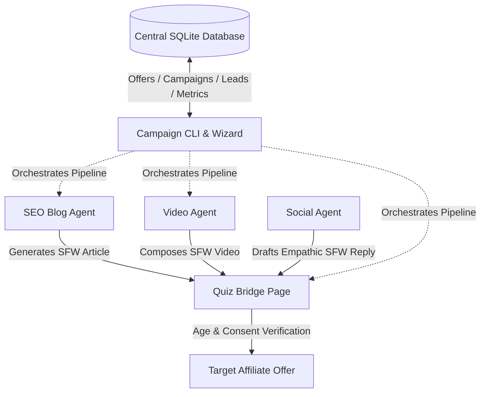

# Technical Architecture

This document describes the high-level architecture, directory structure, data flow, and pipeline execution model of the **my-automated-traffic** suite.

---

## 🗺️ System Architecture Overview

The system operates as a hybrid traffic-generation funnel that transitions safe-for-work (SFW) traffic into high-intent actions, bridging users to affiliate offers:



### Components

1. **CLI / Wizard (Command Line Interface)**: The main entry point. Users can run subcommands or step through an interactive terminal wizard to manage offers and launch campaigns.
2. **SQLite Database**: Coordinates local state (offers, campaigns, generated assets, social leads, and conversion metrics).
3. **Pipeline Orchestrator**: Executes a sequential 3-step pipeline (Bridge Page → Blog Post → Video) to produce output deliverables for a campaign.
4. **Specialized Agents**:
   - **QuizPageGenerator**: Generates static, responsive SFW HTML gateway pages.
   - **BlogAgent**: Writes SEO articles linking to the quiz.
   - **VideoAgent**: Creates vertical video scripts, synthesizes voiceovers, builds scene graphics, and renders the final MP4.
   - **SocialAgent**: Scrapes/validates threads for niche relevance and generates replies.
5. **LLM Client**: Connects to any OpenAI-compatible API endpoint via standard environment variables.

---

## 📂 Project Directory Structure

```
.
├── .gitignore                   # Git exclusion rules
├── README.md                    # Main entry point and installation guide
├── pyproject.toml               # Poetry/UV dependency and packaging manifest
├── uv.lock                      # UV lockfile
├── campaigns.db                 # SQLite database (generated at runtime)
├── docs/                        # Project technical documentation
│   ├── ARCHITECTURE.md          # System design and architecture details
│   ├── DATABASE.md              # Database schema and SQL tables definition
│   └── AGENTS.md                # Specialized agents deep-dive
├── src/
│   └── my_automated_traffic/
│       ├── __init__.py          # Package exports (defining __all__)
│       ├── main.py              # CLI entry point script wrapper
│       ├── cli.py               # Click subcommands and interactive wizard menu
│       ├── database.py          # DatabaseManager class (SQLite connection & queries)
│       ├── llm_client.py        # OpenAIClient wrapper (OpenAI API connection)
│       ├── orchestrator.py      # PipelineOrchestrator automation flow
│       ├── bridge_page.py       # QuizPageGenerator class
│       ├── blog_agent.py        # BlogAgent class
│       ├── video_agent.py       # VideoAgent class
│       └── social_agent.py      # SocialAgent class
└── tests/                       # Pytest suite
    ├── __init__.py
    ├── test_database.py
    ├── test_bridge_page.py
    ├── test_blog_agent.py
    ├── test_video_agent.py
    ├── test_social_agent.py
    └── test_cli.py
```

---

## ⚡ Campaign Output Structure

When the pipeline is triggered, output files are organized by campaign slug under the `output/` directory (which is ignored by Git):

```
output/
└── <campaign-slug>/
    ├── REPORT.md                # Campaign deployment instructions and file index
    ├── bridge/
    │   └── <niche>_quiz.html    # Deployed SFW quiz HTML page
    ├── blog/
    │   └── blog_post.md         # SEO article linking to the bridge page
    └── video/
        ├── output.mp4           # Rendered vertical video
        └── voiceover.mp3        # Synthesized TTS voiceover audio file
```

---

## 🔄 Automation Pipeline Execution Flow

The `PipelineOrchestrator` automates campaign assets generation. The sequential steps are outlined below:

### Step 1: Pre-lander (Bridge Page) Generation
1. Initialize the `QuizPageGenerator` targeting the `output/<campaign-slug>/bridge/` directory.
2. Render an interactive compatibility quiz HTML file using the configured `niche` and the target `offer_url`.
3. Check the path using `os.path.commonpath` to protect against path traversal attacks.
4. Save the generated HTML file as `{clean_niche}_quiz.html`.

### Step 2: SEO Blog Post Generation
1. Initialize the `BlogAgent` using the `OpenAIClient`.
2. Determine the target URL for the blog: use the local path to the newly generated quiz HTML file if step 1 succeeded, otherwise fall back to the offer URL.
3. Call the LLM to write an SEO-optimized SFW blog post around the keyword `{niche} tips`, naturally pitching the quiz link at the end.
4. Write the content as a markdown document (`blog_post.md`) to the `output/<campaign-slug>/blog/` folder.

### Step 3: Video Asset Generation
1. Initialize the `VideoAgent`.
2. Query the LLM for a structured JSON script split into scenes containing `voiceover_text` and a `visual_prompt`.
3. Synthesize the aggregated voiceover text to MP3 using `edge-tts` (asynchronous) to retrieve precise word timestamps for subtitles.
4. Generate the scene images using an optional `imagen_client`. If unavailable, create clean vertical color-gradient background PNGs using `Pillow`.
5. Compose and write the final vertical video using `moviepy`.
   - Apply Ken Burns zoom effect (10% scale up over each scene duration) on background images.
   - Position and overlay a logo watermark at the top-right (if a path to a logo is provided).
   - Render the word-by-word subtitles with the active word highlighted in yellow and other words in white (using Pillow caption PNG frames).
   - Export the composite file to `output/<campaign-slug>/video/output.mp4`.
6. Clean up the intermediate scene images and temporary assets.

### Step 4: Report Generation
1. Build a structured `REPORT.md` file inside the `output/<campaign-slug>/` directory.
2. Populate the report with:
   - Campaign metadata (ID, Offer, Niche, Timestamp).
   - Absolute file paths and names of the generated deliverables.
   - Any pipeline error logs.
   - Deployment guidelines for the bridge page, blog post, video asset, and manual social leads.
