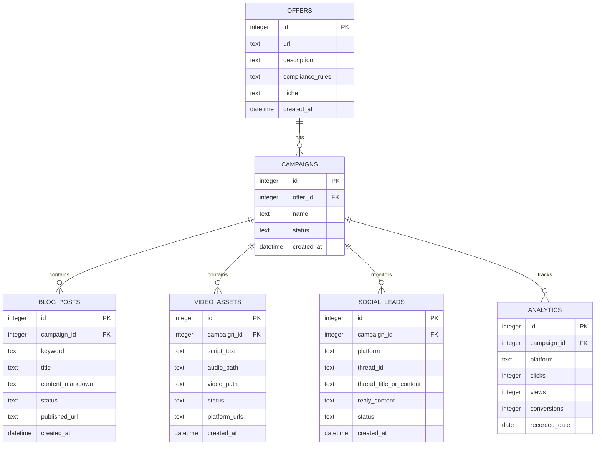

# Database Schema & Data Models

The campaign suite coordinates all local data via a single SQLite database, managed by the [DatabaseManager](file:///Users/vizionik/AffiliateStrategy/src/my_automated_traffic/database.py) class.

---

## 📊 Entity Relationship Diagram



---

## 🗄️ SQL DDL Table Specifications

### 1. `offers`
Stores target affiliate offers, associated niches, and rules.

| Column | Type | Constraints | Description |
| :--- | :--- | :--- | :--- |
| `id` | INTEGER | PRIMARY KEY AUTOINCREMENT | Unique offer identifier. |
| `url` | TEXT | NOT NULL | Target affiliate destination URL. |
| `description` | TEXT | | Details/description of the offer. |
| `compliance_rules` | TEXT | | Promotion compliance boundaries or rules. |
| `niche` | TEXT | NOT NULL | Target marketing niche (e.g. `dating`). |
| `created_at` | DATETIME | DEFAULT CURRENT_TIMESTAMP | Date and time the record was created. |

### 2. `campaigns`
Groups marketing assets around a specific offer.

| Column | Type | Constraints | Description |
| :--- | :--- | :--- | :--- |
| `id` | INTEGER | PRIMARY KEY AUTOINCREMENT | Unique campaign identifier. |
| `offer_id` | INTEGER | NOT NULL, REFERENCES `offers(id)` ON DELETE CASCADE | Target offer this campaign is executing. |
| `name` | TEXT | NOT NULL | User-defined campaign name. |
| `status` | TEXT | NOT NULL DEFAULT `'paused'` | Campaign execution status (`'active'`, `'paused'`). |
| `created_at` | DATETIME | DEFAULT CURRENT_TIMESTAMP | Date and time the record was created. |

### 3. `blog_posts`
Contains generated blog posts for campaign traffic generation.

| Column | Type | Constraints | Description |
| :--- | :--- | :--- | :--- |
| `id` | INTEGER | PRIMARY KEY AUTOINCREMENT | Unique blog post identifier. |
| `campaign_id` | INTEGER | NOT NULL, REFERENCES `campaigns(id)` ON DELETE CASCADE | Parent campaign this blog belongs to. |
| `keyword` | TEXT | NOT NULL | SEO keyword target. |
| `title` | TEXT | NOT NULL | Article title. |
| `content_markdown` | TEXT | NOT NULL | Article markdown content (including pre-lander link). |
| `status` | TEXT | NOT NULL DEFAULT `'draft'` | Publication status (`'draft'`, `'published'`). |
| `published_url` | TEXT | | Final live URL if published on CMS. |
| `created_at` | DATETIME | DEFAULT CURRENT_TIMESTAMP | Date and time the record was created. |

### 4. `video_assets`
Renders video information generated by the `VideoAgent`.

| Column | Type | Constraints | Description |
| :--- | :--- | :--- | :--- |
| `id` | INTEGER | PRIMARY KEY AUTOINCREMENT | Unique video identifier. |
| `campaign_id` | INTEGER | NOT NULL, REFERENCES `campaigns(id)` ON DELETE CASCADE | Parent campaign this video belongs to. |
| `script_text` | TEXT | NOT NULL | Generated script text (containing scenes/subtitles). |
| `audio_path` | TEXT | | Local path to the synthesized voiceover MP3. |
| `video_path` | TEXT | | Local path to the composed MP4 video file. |
| `status` | TEXT | NOT NULL DEFAULT `'queued'` | Video status (`'queued'`, `'composing'`, `'done'`, `'failed'`). |
| `platform_urls` | TEXT | | Comma-separated or JSON list of URLs where uploaded. |
| `created_at` | DATETIME | DEFAULT CURRENT_TIMESTAMP | Date and time the record was created. |

### 5. `social_leads`
Saves social threads identified by `SocialAgent` and their drafted responses.

| Column | Type | Constraints | Description |
| :--- | :--- | :--- | :--- |
| `id` | INTEGER | PRIMARY KEY AUTOINCREMENT | Unique lead identifier. |
| `campaign_id` | INTEGER | NOT NULL, REFERENCES `campaigns(id)` ON DELETE CASCADE | Parent campaign this lead targets. |
| `platform` | TEXT | NOT NULL | Platform name (e.g. `'Reddit'`, `'X'`). |
| `thread_id` | TEXT | NOT NULL | Unique platform identifier for the post thread. |
| `thread_title_or_content` | TEXT | | Text content or title of the original post thread. |
| `reply_content` | TEXT | | SFW draft response prepared by the agent. |
| `status` | TEXT | NOT NULL DEFAULT `'scraped'` | Lead status (`'scraped'`, `'relevant'`, `'ignored'`, `'replied'`). |
| `created_at` | DATETIME | DEFAULT CURRENT_TIMESTAMP | Date and time the record was created. |

*Unique constraint: `UNIQUE(platform, thread_id)` prevents scraping or recording the same thread twice.*

### 6. `analytics`
Tracks daily view, click, and conversion statistics per campaign/platform.

| Column | Type | Constraints | Description |
| :--- | :--- | :--- | :--- |
| `id` | INTEGER | PRIMARY KEY AUTOINCREMENT | Unique analytics record identifier. |
| `campaign_id` | INTEGER | NOT NULL, REFERENCES `campaigns(id)` ON DELETE CASCADE | Parent campaign. |
| `platform` | TEXT | NOT NULL | Platform (e.g. `'TikTok'`, `'Reddit'`, `'Blog'`). |
| `clicks` | INTEGER | DEFAULT 0 | Count of click events. |
| `views` | INTEGER | DEFAULT 0 | Count of view impressions. |
| `conversions` | INTEGER | DEFAULT 0 | Count of successful affiliate redirections. |
| `recorded_date` | DATE | NOT NULL | Date this metric represents. |

*Unique constraint: `UNIQUE(campaign_id, platform, recorded_date)` enforces one log entry per campaign, per platform, per day.*

---

## 🛠️ Database Access Layer

The [DatabaseManager](file:///Users/vizionik/AffiliateStrategy/src/my_automated_traffic/database.py) class encapsulates SQLite queries:

### Initialization
```python
db = DatabaseManager("campaigns.db")
db.initialize()  # Creates all tables if they do not exist
```
- Sets `PRAGMA foreign_keys = ON;` to enforce cascade deletes.
- Enables `sqlite3.Row` row factory for named key column access.

### Core Database API Methods
- `get_tables(self) -> List[str]`: Lists active tables (excluding sqlite internal tables).
- `add_offer(self, url: str, description: str, compliance_rules: str, niche: str) -> int`: Inserts an offer, returns its row ID.
- `add_campaign(self, offer_id: int, name: str) -> int`: Inserts a campaign linked to an offer, returns its row ID.
- `update_campaign_status(self, campaign_id: int, status: str) -> None`: Sets status to `'active'` or `'paused'`. Raises `ValueError` for other statuses.
- `get_active_campaigns(self) -> List[sqlite3.Row]`: Fetches active campaigns.
