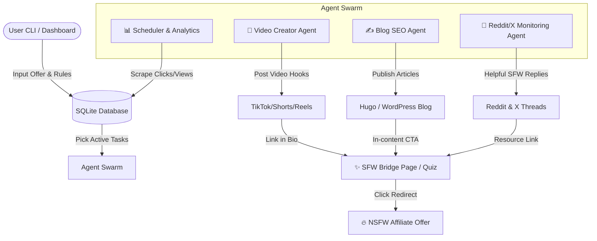

# Design Specification: AI-Automated Affiliate Traffic Strategy (NSFW Hybrid Model)

**Date**: 2026-06-21  
**Status**: Draft / Awaiting Review  
**Architecture Pattern**: Swarm of Specialized Python Agents + SQLite DB (FastAPI/React Ready)

---

## 1. System Overview

This system is a fully automated, AI-driven organic traffic generator designed to promote adult/NSFW affiliate offers. Because mainstream platforms (Google SEO, TikTok, YouTube, Instagram Reels) strictly ban NSFW content, this system utilizes a **Hybrid SFW Hook / Bridge Funnel** strategy:
1. **SFW Channels** (TikTok, YouTube Shorts, SEO Blogging, general Reddit/X threads) use Safe For Work, high-curiosity relationship advice, dating tips, and humor to drive traffic to an interactive pre-lander (quiz or guide).
2. **Interactive Pre-lander** acts as a compliance buffer, where users explicitly opt-in or self-verify before being redirected to the adult/NSFW affiliate offer.
3. **Direct NSFW Channels** (Reddit NSFW subreddits, adult forums) bypass the pre-lander, promoting offers directly or through focused SFW/NSFW landing gates.

The system is built as a modular set of Python CLI scripts executing tasks asynchronously and coordinating via a shared SQLite database. The entire codebase is designed with clean boundaries, allowing it to be easily wrapped in a FastAPI web server and converted into a SaaS dashboard.

---

## 2. High-Level Architecture & Data Flow



---

## 3. Database Schema (SQLite)

We use SQLite for local persistence. Table structures are designed to hold campaign configs, scheduled outputs, active leads, and metrics.

```sql
-- Affiliate Offers provided by the user
CREATE TABLE offers (
    id INTEGER PRIMARY KEY AUTOINCREMENT,
    url TEXT NOT NULL,                  -- Target affiliate destination URL
    description TEXT,                   -- General description of target product
    compliance_rules TEXT,              -- Do's and Don'ts for content creation
    niche TEXT NOT NULL,                -- e.g., "dating", "relationship-advice"
    created_at DATETIME DEFAULT CURRENT_TIMESTAMP
);

-- Active traffic generation campaigns
CREATE TABLE campaigns (
    id INTEGER PRIMARY KEY AUTOINCREMENT,
    offer_id INTEGER NOT NULL REFERENCES offers(id) ON DELETE CASCADE,
    name TEXT NOT NULL,
    status TEXT NOT NULL DEFAULT 'paused', -- 'active', 'paused'
    created_at DATETIME DEFAULT CURRENT_TIMESTAMP
);

-- Blog post content queue
CREATE TABLE blog_posts (
    id INTEGER PRIMARY KEY AUTOINCREMENT,
    campaign_id INTEGER NOT NULL REFERENCES campaigns(id) ON DELETE CASCADE,
    keyword TEXT NOT NULL,
    title TEXT NOT NULL,
    content_markdown TEXT NOT NULL,
    status TEXT NOT NULL DEFAULT 'draft',  -- 'draft', 'ready', 'published'
    published_url TEXT,
    created_at DATETIME DEFAULT CURRENT_TIMESTAMP
);

-- Video generation and scheduling queue
CREATE TABLE video_assets (
    id INTEGER PRIMARY KEY AUTOINCREMENT,
    campaign_id INTEGER NOT NULL REFERENCES campaigns(id) ON DELETE CASCADE,
    script_text TEXT NOT NULL,
    audio_path TEXT,                    -- Path to local synthesized TTS MP3
    video_path TEXT,                    -- Path to final stitched MP4 video file
    status TEXT NOT NULL DEFAULT 'queued', -- 'queued', 'generating', 'ready', 'posted'
    platform_urls TEXT,                 -- JSON list of published links (TikTok, Shorts, Reels)
    created_at DATETIME DEFAULT CURRENT_TIMESTAMP
);

-- Track scraped social media threads and automated replies
CREATE TABLE social_leads (
    id INTEGER PRIMARY KEY AUTOINCREMENT,
    campaign_id INTEGER NOT NULL REFERENCES campaigns(id) ON DELETE CASCADE,
    platform TEXT NOT NULL,             -- 'reddit', 'x'
    thread_id TEXT NOT NULL,            -- ID of post/tweet
    thread_title_or_content TEXT,       -- Text context of thread
    reply_content TEXT,                 -- Generated AI SFW response
    status TEXT NOT NULL DEFAULT 'scraped', -- 'scraped', 'drafted', 'replied', 'ignored'
    created_at DATETIME DEFAULT CURRENT_TIMESTAMP,
    UNIQUE(platform, thread_id)
);

-- Campaign-level performance analytics
CREATE TABLE analytics (
    id INTEGER PRIMARY KEY AUTOINCREMENT,
    campaign_id INTEGER NOT NULL REFERENCES campaigns(id) ON DELETE CASCADE,
    platform TEXT NOT NULL,             -- 'tiktok', 'shorts', 'reels', 'blog', 'reddit', 'x', 'pre-lander'
    clicks INTEGER DEFAULT 0,
    views INTEGER DEFAULT 0,
    conversions INTEGER DEFAULT 0,
    recorded_date DATE NOT NULL UNIQUE
);
```

---

## 4. Component Specifications

### 4.1 Offer & Compliance Management
- **CLI Commands**:
  - `python cli.py create-offer --url "AFFILIATE_URL" --description "DESC" --rules "RULES" --niche "NICHE"`
  - `python cli.py create-campaign --name "CAMPAIGN_NAME" --offer-id ID`
- **Logic**: Integrates user inputs into the SQLite DB. Evaluates basic validations (ensures valid URL structure, validates parameters).

### 4.2 SFW Bridge Landing Page Engine
- **Purpose**: Generates interactive, mobile-friendly landing pages (pre-landers) that act as SFW gateways.
- **Engine Options**:
  - A lightweight local template compiler (Jinja2) generating static HTML files.
  - Can be served via a local Python web server (FastAPI/Uvicorn) or pushed automatically to static hosting (Netlify, Vercel, or GitHub Pages via APIs).
- **Core Feature**: Interactive Quiz (e.g., "Find Your Match Style Quiz"). On completing the quiz, users click a CTA (e.g., "Reveal My Match Blueprint") which triggers a SFW age/consent confirmation dialog before forwarding to the NSFW affiliate link.

### 4.3 SFW SEO Blog Generator Agent
- **Workflow**:
  1. **Keyword Research**: Queries free/local suggestion databases or scrapes autocomplete APIs (like Google Suggest) for questions surrounding dating, flirting tips, relationship problems, and communication.
  2. **Article Generation**: Calls LLM (Gemini 2.5 Flash / OpenAI GPT-4o-mini) to write a detailed 1,000+ word article offering real, helpful advice.
  3. **CTA Ingestion**: Naturally inserts an optimized CTA box linking to the campaign's SFW Bridge Landing page (e.g. *"Struggling to read signals? Take our 2-minute Flirting Style Quiz to find out what you are doing wrong."*).
  4. **Publishing**: Saves article as markdown or HTML. If configured with a WordPress API token or Hugo static output path, automatically deploys the article.

### 4.4 SFW Short-form Video Creator Agent
- **Workflow**:
  1. **Script Drafting**: LLM writes a 30-45s script (highly engaging, text-overlay heavy) focusing on dating tips, psychology facts, or funny relationship memes.
  2. **Voice Synthesis**: Generates a high-quality SFW voiceover using python-gTTS, Edge-TTS, or ElevenLabs.
  3. **Visual Stitching**: Stitches royalty-free SFW background loops (dating couples, abstract aesthetic animations, typing screen recordings) with the audio track.
  4. **Subtitles & Overlays**: Auto-burns text subtitles using MoviePy / FFmpeg.
  5. **Queuing & Storage**: Saves the final `.mp4` video locally to a designated asset directory and marks the state as `ready` in the database.
  6. **Upload Scope**: For version 1, direct uploading is handled manually by the user (or via external third-party scheduler tools) using the generated video file. Auto-publishing via platform API/automation is a secondary phase feature due to strict account token/cookie expiration limits.

### 4.5 Reddit/X Social Reply Monitoring Agent
- **Workflow**:
  1. **Reddit Monitor**: Scrapes subreddits (e.g. `r/dating_advice`, `r/relationship_advice`, `r/flirting`) for recent questions matching keywords.
  2. **X Monitor**: Performs Twitter search queries for relevant advice-seeking phrases.
  3. **Content Filtering**: LLM reviews the thread: *Is this thread asking for advice related to our campaign's niche?*
  4. **Helpful Reply Drafting**: LLM drafts a highly helpful, comprehensive response (200-300 words). It does **not** spam affiliate links.
  5. **Soft Hooking**: Links back to our SFW blog post as a reference for further reading (*"I wrote a detailed guide on this exact topic here: [SFW Blog URL]"*). This keeps the Reddit/X account compliant and builds karma.

---

## 5. Transition to SaaS (Future Ready)

The system is architected to allow conversion into a multi-tenant SaaS dashboard:
- **FastAPI Backend wrapper**: A thin API layer (`app/main.py`) will expose DB tables via REST endpoints and allow triggering agents via background tasks (Celery or python-background tasks).
- **React/Next.js Dashboard**: Users will login, manage affiliate credentials, view performance charts, and launch automated campaigns.
- **Multi-Tenancy**: The SQLite schema can easily be migrated to PostgreSQL (using SQLAlchemy or Prisma migrations) by adding a `user_id` column to the `offers` and `campaigns` tables.

---

## 6. Tech Stack & Key Libraries

- **Programming Language**: Python 3.11+
- **Database**: SQLite3 (native python library)
- **Web/API**: FastAPI + Uvicorn (ready for dashboard layer)
- **Video Editing**: MoviePy, FFmpeg, Edge-TTS (for text-to-speech)
- **Scraping / Integration**: PRAW (Python Reddit API Wrapper), Tweepy (X API wrapper), or Playwright (for scraping search queries)
- **LLM Integrations**: Google GenAI SDK (Gemini 2.5 Flash) or OpenAI API (GPT-4o-mini)

---

## 7. Compliance, Safety, & Risk Management

1. **Strict Content Gating**: Blog posts and short-form videos must never contain nudity, explicit language, or direct NSFW suggestions to protect domain authority and account standings.
2. **Account Rate-Limiting**: To prevent Reddit/X account bans, the social agent must not post more than 3-5 replies per account per day, and must random-delay posts by 10-30 minutes.
3. **No Direct Spamming**: Social replies must provide actual value. Spamming links without answering the thread's core question is forbidden.
